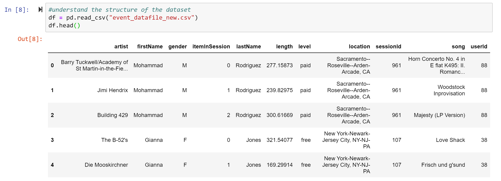

# DataEngineering-DataModelingWithApacheCassandra

## Overview
A startup called Sparkify wants to analyze the data they've been collecting on songs and user activity on their new music streaming app. The analysis team is particularly interested in **understanding what songs users are listening to.**  
In this projects, we create an Apache Cassandra database and build up an ETL pipeline which can create queries on song play data to answer the questions. The ETL pipeline transfers data from a set of CSV files within a directory to create a streamlined CSV file to model and insert data into Apache Cassandra tables.  

## Datasets
A set of csv files named `event_data`, partitioned by date. Example of filepath of the csv files:
```
event_data/2018-11-08-events.csv
event_data/2018-11-09-events.csv
```
We will process these files into one single denormalized dataset (csv file) named `event_datafile_new.csv`.  
The structure of `event_datafile_new.csv` looks like:



## Project Steps
We have 3 keen interests about the topic. They are:  
1. Give me the artist, song title and song's length in the music app history that was heard during sessionId = 338, and itemInSession = 4
2. Give me only the following: name of artist, song (sorted by itemInSession) and user (first and last name) for userid = 10, sessionid = 182¶
3. Give me every user name (first and last) in my music app history who listened to the song 'All Hands Against His Own'¶

<br>

- For each interest, we first define the specific query.
- Based on the query, we design the structure of table in Apache Cassandra NoSQL database. Then we CREATE the table and INSERT values into it using data from `event_datafile_new.csv`.
- Finally, we perform the query of our interest.  

